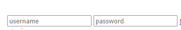
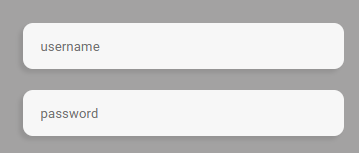

<h1>Projeto Login</h1>

(Objetivo do projeto)

Aprender a construir de forma simples e dinamica uma tela de login, sem a necessidade de complexidade inicial incluindo <strong>Placeholder.</strong>

 <h2>Placeholder serve para indicar o que deve ser colocado ali.</h2>

<h1>Erros do projeto</h1>

Ao completar toda estrutura em html e estilizar algumas partes no css encontrei erros.

<ul>
<li>Erro no espaçamento do placeholder.</li>
<li>Forgot password colado na borda direita.</li>
<li>Imagem link do meio desalinhada.</li>
<li>social-media container colada na borda debaixo.</li>
</ul>

<h1>Resolução dos erros</h1>

<ul>
<li>input sem padding, padding-left: 18px; foi o suficiente para arrumar. </li>

<li>forgot password descolado da borda, solução no container (  width: 321px; height: 46px; margin: 0 auto;) no forgot password a mesma coisa com text-align: right;</li>

 <li>imagem do meio da media acima das demais, no container social-media coloquei (display: flex; justify-content: center; align-items: center;)</li>

 <li>Diminui a margin do img-yoga, forgot-password e do input e o social-media ficou descolado da borda do fundo.</li>
</ul>

